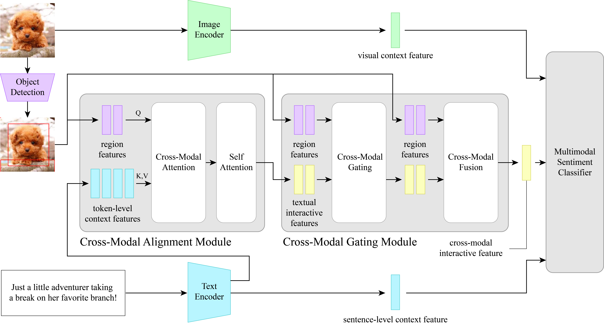
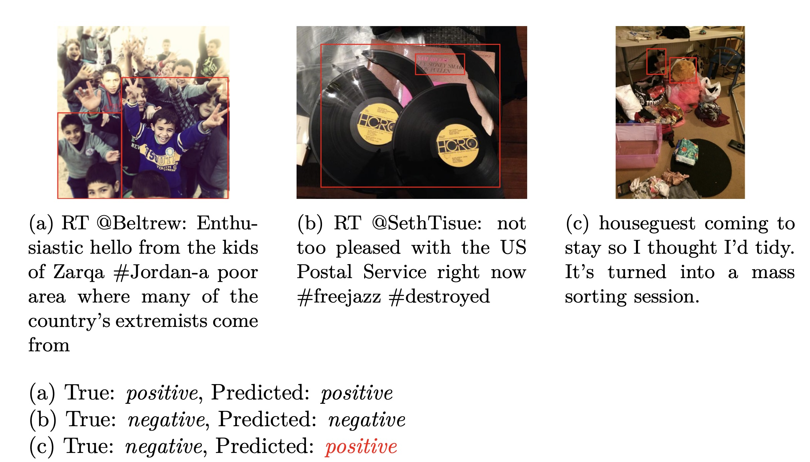

### Improve Multimodal Sentiment Analysis with Open-Set Object Detection

This thesis explores the integration of multimodal data for sentiment analysis, focusing on improving the ITIN model, which aligns image regions with corresponding text for better sentiment detection. Traditional sentiment analysis mainly uses text, but social media content often combines text and images, necessitating multimodal approaches. To enhance ITIN, two new models are introduced: ITIN-CLIP, which employs the CLIP model for shared image-text feature extraction, and ITIN-CLIP-GDINO, which incorporates Grounding DINO for more flexible detection of sentiment-relevant regions in images. Evaluations on the MVSA dataset show that these improvements lead to better sentiment classification, though challenges like class imbalance and misalignment persist.



## Related Papers

1. [ITIN paper](https://ieeexplore.ieee.org/abstract/document/9736584)
2. [CLIP paper](https://arxiv.org/abs/2103.00020)
3. [Grounding DINO paper](https://arxiv.org/abs/2303.05499)

## Requirements

This thesis requires the following:

1. **Python**: `python3.11`. You can check your version by running:
```bash
python3 --version
```
2. Install the required packages from `requirements.txt`
```bash
pip install -r requirements.txt
```

## Usage

### Dataset

You can download the **MVSA dataset** from the following sources:

- **MVSA dataset**: [MVSA Sentiment Analysis Dataset](https://mcrlab.net/research/mvsa-sentiment-analysis-on-multi-view-social-data/)
- **Training/Test Split**: The training-test split follows the methodology outlined in this publication: [CLMLF GitHub](https://github.com/Link-Li/CLMLF)
- **Processed Dataset**: The processed dataset, including precomputed features, can be downloaded from this [Google Drive link](https://drive.google.com/drive/folders/1Z166RQc7tun694Gr7OPRn_ghDhtc51hN)

#### Processed Dataset Contents:
The zip file from the above link contains the following:

- `data`: The original MVSA image and text data pairs.
- `features_fasterrcnn_bua`: Precomputed region features using a pretrained Faster R-CNN model, implemented by [Bottom-Up Attention](https://github.com/MILVLG/bottom-up-attention.pytorch).
- `features_grounding_dino[1-5]`: Precomputed region features using Grounding DINO with five different input text prompts.

#### Setup:
- Once downloaded, place the contents of the zip file under the `data/` directory.

### Pre-trained Models: 

The pre-trained models for each dataset can be found in the following table:

| **Model**            | **MVSA-Single**         | **MVSA-Multiple**         |
|----------------------|-------------------------|---------------------------|
| ITIN                 | [link1](#link1)         | [link2](#link2)           |
| ITIN-CLIP            | [link3](#link3)         | [link4](#link4)           |
| ITIN-CLIP-GDINO      | [link5](#link5)         | [link6](#link6)           |

Download the saved models:
<!-- 20240901_1908_mvsa_single -->
<!-- 20240903_0048_mvsa_single -->
<!-- 20240910_2038_mvsa_single -->
<!-- 20240901_1917_mvsa_multiple -->
<!-- 20240903_0052_mvsa_multiple -->
<!-- 20240910_2255_mvsa_multiple -->

### Train the Model

To train the model, use the following command:

```bash
cd code
python itin.py --cfg configs/itin_base.yaml --dataset mvsa_single --random_seed 1
```

- --cfg: specify the configuration file.
- --dataset: define the dataset to use (mvsa_single or mvsa_multiple).
- --random_seed: set a seed for initialization.

### Test the Model

To test the model with a pre-trained checkpoint, run the following command:

```bash
cd code
python itin.py --cfg configs/itin_base.yaml --dataset mvsa_single --load_model path_to_model --no-training
```

- --load_model: load the pre-trained model.
- --no-training: run the testing phase only.

## Results

### Performance Summary:

| **Model**             | **MVSA-Single** | **MVSA-Single** | **MVSA-Multiple** | **MVSA-Multiple** |
|-----------------------|-----------------|-----------------|-------------------|-------------------|
|                       | **Accuracy**    | **F1-score**    | **Accuracy**      | **F1-score**      |
| ITIN                  | 0.6831          | 0.6765          | 0.7058            | 0.6677            |
| ITIN-CLIP             | 0.7160          | 0.7051          | 0.6960            | 0.6393            |
| ITIN-CLIP-GDINO       | **0.7733**      | **0.7571**      | 0.6992            | 0.6473            |
| ITIN (Zhu et al. 2023)| 0.7519          | 0.7497          | **0.7352**        | **0.7349**        |
 
### Visualization Example:

Below are visualizations of three examples from the test data.

